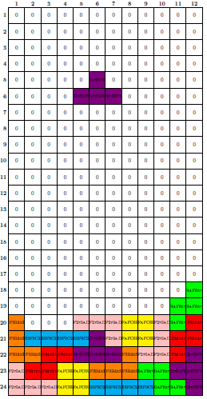
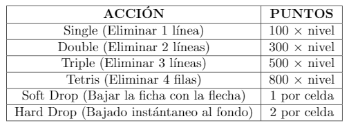

<p align="right"></p>

# TETRIS (Utilizando POO)
## Juan Sebastián Castro Pardo

___

### 1. Introducción

Tetris es un videojuego de lógica originalmente diseñado y programado por Alekséi Pázhitnov en la Unión Soviética. Su nombre deriva del prefijo griego *tetra* (todas las piezas del juego, conocidas como **tetrominós** que contienen cuatro segmentos) y del tenis. El juego está disponible para casi cada consola de videojuegos y sistemas operativos de PC, así como en dipositivos tales como las calculadoras gráficas, teléfonos móviles, reproductores de multimedia portátiles, PDAs, entre otros.

Distintos tetrominós, figuras geométricas compuestas por cuatro bloques cuadrados unidos de forma ortogonal, los cuales se generan de una zona que ocupa 5x5 bloques en el área superior de la pantalla. El jugador no puede impedir esta caída, pero puede decidir la rotación de la pieza (0°, 90°, 180°, 270°) y en qué lugar debe caer. Cuando una línea horizontal se completa, esa línea desaparece y todas las piezas que están por encima descienden una posición, liberando espacio del juego y por tanto dacilitando la tarea de situar piezas nuevas. La caída de las piezas se acelera progresivamente. El juego acaba cuando las piezas se amontonan hasta llegar a lo más alto (3x5 bloques en el área visible), interfiriendo la creación de más piezas y finalizando el juego.

<p align="center"></p>

### 2. Desarrollo

El programa se desarrolló en *processing*. Processing es un flexible software de bloc de dibujo y lenguaje para aprender como codificar en el contexto de las artes visuales. Para programar se empleo programación orientada a objetos.

La idea que desarrolle durante fue el uso de tres clases, llamadas *Tetromino*, *Tablero* y el *Tablero Memoria*, que las explicaré en detalle más adelante. La versión actual del programa es capaz de generar fichas aleatorias, posicionarlas en el fondo del tablero, apilarlas y eliminar las filas cuando estan estas se completen y llevar la cuenta del puntaje, nivel y filas eliminadas.

### 2.1. Clases
### 2.1.1. Tetromino

La clase tetromino es la encargada de la información y los métodos de cada tetromino que se crea y se pone en juego. Para instanciar la forma de cada tetromino, utilize arrays que contienen datos de las coordenadas de cada cuadro del tetromino. El sistema de coordenadas funciona de la siguiente manera:

<p align="center"></p>

La coordenada asignada a cada bloque no solo permite dibujarlo, sino también rotarlo facilmente. Para dibujar el bloque a partir de las coordenadas se hace de la siguiente manera:

```processing
//Arrays para cada ficha
int[][] O = {{0, 0}, {1, 0}, {0, 1}, {1, 1}}; //O
int[][] I = {{0, 0}, {1, 0}, {2, 0}, {3, 0}}; //I
int[][] T = {{0, 0}, {1, 0}, {2, 0}, {1, 1}}; //T
int[][] L = {{0, 0}, {1, 0}, {2, 0}, {0, 1}}; //L
int[][] J = {{0, 0}, {0, 1}, {1, 1}, {2, 1}}; //J
int[][] S = {{0, 1}, {1, 1}, {1, 0}, {2, 0}}; //S
int[][] Z = {{0, 0}, {1, 0}, {1, 1}, {2, 1}}; //Z

void display() {
    push();
    strokeWeight(1);
    fill(Color);
    for (int i = 0; i < 4; i++) { //Recorre el array de cada figura
      rect(figura[i][0] * t_casilla, figura[i][1] * t_casilla, t_casilla, t_casilla); //t_casilla = width/24
    };
    pop();
  }
```

Para cada figura se crea un array bidimensional en donde las coordenadas *x* y *y* de cada punto se llaman utilizando ```figura[i][0]``` y ```figura[i][1]``` respectivamente, donde *i* es el elemento de la lista. Son varios los métodos que se encuentran dentro de la clase tetromino, el método ```display()``` que mostramos anteriormente, el ```m_sig()```, que se encarga de mostrar la siguiente figura en la parte derecha del tablero,

```processing
 void m_sig() { 
    fill(179, 244, 208);
    rect(width/2, 0, width/2, height);
    fill(0);
    text("SIGUIENTE FICHA:", width/2 + 60, 70);
    fill(83, 147, 111);
    text("SIGUIENTE FICHA:", width/2 + 62, 72);
    push();
    strokeWeight(1);
    fill(Color);
    for (int i = 0; i < 4; i++) {
      rect(figura[i][0] * t_casilla + width/2 + 140, figura[i][1] * t_casilla + 100, t_casilla, t_casilla); //La muestro en la parte derecha del tablero
    };
    pop();
  }
```

El método ```mover()``` que recibe información de una string que varía dependiendo la tecla que se este presionando, y que como su nombre lo indica, provoca el desplazamiento de la figura a través del tablero,

```processing
oid mover(String direccion) { //Direccion dada por una string
    //Primero verificamos si es posible realizar el movimiento
    if (limite(direccion)) {
      if (direccion == "DERECHA") {
        for (int i = 0; i < 4; i++) {
          figura[i][0]++; //Sumar 1 a la posición en x
        }
      } else if (direccion == "IZQUIERDA") {
        for (int i = 0; i < 4; i++) {
          figura[i][0]--; //Restar 1 a la posición en x
        }
      } else if (direccion == "ABAJO") {
        for (int i = 0; i < 4; i++) {
          figura[i][1]++; //Sumar 1 a la posición en y
        }
      }
    }
  }
```

Luego vienen los métodos ```sombra()``` y ```bajarfondo()``` que utilizan una variable de tipo booleano llamada ```fondosombra``` que nos indica cual es la posición máxima en y que puede ocupar la figura en las posiciones de x actuales. El primer método que mencioné, se encarga de dibujar la sombra de la figura, es decir, donde va a caer,

```processing
  void sombra(T_memoria tab) {
    int[] valores = {figura[0][1], figura[1][1], figura[2][1], figura[3][1]};
    //busco los valores máximos y mínimos en y de la figura
    max_y = max(valores); 
    min_y = min(valores);
    
    //Verifica todas las filas desde la máxima de y hasta la última
    for ( int k = max_y; k < 24; k++) {
      if (fondosombra(tab, k, max_y)) {
      } else { //Si la fila es el fondo, dibuja la sombra
        push();
        strokeWeight(1);
        stroke(Color);
        fill(0);
        for (int j = 0; j < 4; j++) {
          x_sombra = figura[j][0];
          y_sombra = figura[j][1];
          if (max_y < ((k-(max_y-min_y))-1)) {
            rect(x_sombra * t_casilla, ((k-1) - (max_y - y_sombra)) * t_casilla, t_casilla, t_casilla);
          }
        };
        pop();
        k = 24;
      };
      if (k==23) { //Si no encontro una fila que actúe como fondo, eso quiere decir que el fondo es la fila 23
        push();
        strokeWeight(1);
        stroke(Color);
        fill(0);
        for (int j = 0; j < 4; j++) {
          x_sombra = figura[j][0];
          y_sombra = figura[j][1];
          if (max_y < (23-(max_y-min_y))) {
            rect(x_sombra * t_casilla, (23 - (max_y - y_sombra)) * t_casilla, t_casilla, t_casilla);
          }
        };
        pop();
      }
    }
  }

```

El segundo método también utiliza la variable booleana, pero en este caso para provocar la caída de la figura hasta el fondo,

```processing
int filasbajadas; //Para contar las filas que bajan 
  //Bajar la figura hasta el fondo
  void bajarfondo(T_memoria tab) {
    int[] valores = {figura[0][1], figura[1][1], figura[2][1], figura[3][1]};
    max_y = max(valores);
    min_y = min(valores);
    
    //Verifica todas las filas
    for ( int k = max_y; k < 24; k++) {
      if (fondosombra(tab, k, max_y)) {
      } else { //Una vez encuentra la fila fondo, cambia los valores de y de la figura
        for (int i = 0; i < 4; i++) {
          figura[i][1] = (figura[i][1] + (k - max_y))-1;
          filasbajadas = (k - max_y)-1;
        };
        k = 24;
      }
      
      //Si ninguna fila actúa como el fondo, eso quiere decir que el fondo es la fila 23
      if (k==23) { 
        for (int j = 0; j < 4; j++) {
          figura[j][1] = figura[j][1] + (23 - max_y);
          filasbajadas = 23 - max_y;
        }
      }
    }
  }

```

Por último nos encontramos con los métodos ```caida``` y ```rotar```. El primero es bastante sencillo, genera una velocidad de caída de la figura dependiendo del nivel actual, y llama a la función mover,

```processing
 void caida(int nivel) { //la velocidad de caída depende del nivel
      if (tiempo%(50-(nivel*5)) == 0) { //Entre mayor sea el módulo menor será la velocidad de caída
        mover("ABAJO");
      }
      tiempo ++; //aumentamos el contador
    }
```

El método ```rotar``` utiliza las coordenadas *x* y *y* de la figura, y realiza el procedimiento de rotar la figura como se mostró anteriormente en la figura,

```processing
void rotar() {
      if (figura != O) { //No aplicar la rotación si la figura es la O

        //nueva array para la rotación
        //Siempre rotamos la figura original (f_original)
        //Le restamos la posición actual para que rote en esa posición
        int[][] rotacion = new int[4][2];

        //90° (x,y) = (y,-x)
        if (cont_rotaciones%4 == 0) {
          for (int i = 0; i < 4; i++) {
            rotacion[i][0] = f_original[i][1] - figura[1][0]; 
            rotacion[i][1] = -f_original[i][0] - figura[1][1];
          }
        }

        //180° (x,y) = (-x,-y)
        else if (cont_rotaciones%4 == 1) {
          for (int i = 0; i < 4; i++) {
            rotacion[i][0] = -f_original[i][0] - figura[1][0]; 
            rotacion[i][1] = -f_original[i][1] - figura[1][1];
          }
        }

        //270° (x,y) = (-y,x)
        else if (cont_rotaciones%4 == 2) {
          for (int i = 0; i < 4; i++) {
            rotacion[i][0] = -f_original[i][1] - figura[1][0]; 
            rotacion[i][1] = f_original[i][0] - figura[1][1];
          }
        }

        //360°(Retornar al lugar original)
        else if (cont_rotaciones%4 == 3) {
          for (int i = 0; i < 4; i++) {
            rotacion[i][0] = f_original[i][0] - figura[1][0]; 
            rotacion[i][1] = f_original[i][1] - figura[1][1];
          }
        }

        figura = rotacion; //guardamos los datos de la figura rotada en la figura actual
      }
    }
```

### 2.1.2. Tablero

Esta clase es muy simple, solo se encarga del despliegue del tablero principal. Dibuja las lineas que dividen cada casilla,

```processing
class Tablero {

  //Variable del tamaño de cada casilla
  float t_casilla;

  //Constructor
  Tablero() {
    t_casilla = width/24; //Establezco el tamaño de cada casilla
  }

  //Establezco el metodo display para dibujar el tablero en la pantalla
  void display() {
    stroke(255);
    for (int i = 0; i < 13; i++) {
      line(0, i * t_casilla, width/2, i * t_casilla); //Lineas horizontales 0-13
      line(0, (i+12) * t_casilla, width/2, (i+12) * t_casilla); //Lineas horizontales 13-25  
      line(i * t_casilla, 0, i * t_casilla, height); //Lineas verticales
    }
  }
}
```

### 2.1.3. Tablero Memoria

Es junto con la clase ```tetromino``` las bases del juego. Se trata de una matriz tridimensional donde se almacenan las cordenadas *x* y *y*, y en el tercer espacio se guarda el color de cada casilla. Esto es muy útil ya que es por colores como se identifica si una ficha puede seguir bajando o no, si encuentra un color diferente al negro, deja de bajar.

<p align="center"></p>

En la matriz memoria [ i ] [ j ] [ col ] se almacena la columna i, la fila j y el color de la casilla. Esta clase cuenta con métodos vitales para el juego. En primer lugar tenemos el método ```display```, que dibuja el tablero en pantalla a partir de la matriz memoria.

``` processing
 void display() {
    for (int i = 0; i < 12; i++) { //Recorre todas las filas y columnas 
      for (int j = 0; j < 24; j++) {
        //Elegir el color
        n_color = colores[i][j][0]; //Extrae el color de la casilla de la matriz
        fill(n_color);
        rect(i * t_casilla, j * t_casilla, t_casilla, t_casilla); 
        //Dibuja un rectangulo del color seleccionado en la posición actual
      }
    }

    //Si hay una fila completa...
    for (int i = 0; i < 24; i++) { //Verifica las 24 filas
      if (fil_completa(i)) { //Mira si arroja verdadero
        f_eliminadas ++;
        eliminar(i); //Elimina la fila i
      };
    };
    lineas_t += f_eliminadas;
    //Asigno el puntaje por filas eliminadas
    while (f_eliminadas != 0) {
      if (f_eliminadas >= 4) {
        puntaje = puntaje + (((f_eliminadas - (f_eliminadas%4))/4) * 800 * nivel);
        f_eliminadas = f_eliminadas - (f_eliminadas - (f_eliminadas&4));
      } else if (f_eliminadas == 3) {
        puntaje = puntaje + (500 * nivel);
        f_eliminadas = f_eliminadas - 3;
      } else if (f_eliminadas == 2) {
        puntaje = puntaje + (300 * nivel);
        f_eliminadas = f_eliminadas -2;
      } else if(f_eliminadas == 1){
        puntaje = puntaje + (100 * nivel);
        f_eliminadas --;
      }
    };
    
    //Por último miramos si se puede cambiar de nivel
    if(lineas_t >= (nivel*10)){
      println("listo");
      nivel ++;
    }
  }
```

Dentro de este método también se revisa si hay alguna fila completa para eliminarla, sumar los puntos correspondientes por haberla completado y verificar si el jugador ha subido de nivel. Otro método que tiene esta clase es el ```plasmar``` que como su nombre induce, plasma la figura en la matriz luego de haber sido posicionada en el tablero. 

```processing
  //Método plasmar figura en el tablero memoria
  void plasmar(Tetromino f) { //Recibe los datos de algún tetromino
    //Coordenadas de cada bloque
    for (int i = 0; i < 4; i++) {
      x = f.figura[i][0]; //Coordenada x de la ficha
      y = f.figura[i][1]; //Coordenada y de la ficha
      //Añadir el color
      colores[x][y][0] = f.Color; //Guarda en la matriz el color de la ficha
    }
  }
```

El último es el método ```eliminar```, que simplemente elimina la fila completa y baja las demás.

```processing
  //Eliminar filas
  void eliminar(int fil) {
    for (int j = fil; j >= 1; j--) {
      for (int i = 0; i < 12; i++) { //Verifica todas las casillas de la fila
        colores[i][j][0] = colores[i][j-1][0]; //Las cambia por casillas negras
      }
    }
  }
```

### 2.2. Estructura principal del programa

Ahora mostraré como se emplean las diferentes clases y sus respectivos métodos y atributos para la estructuración del juego. En ```setup``` se establece el tamaño de la ventana, se crean variables de tipo tablero, tablero memoria y tetromino, y por ultimo se utiliza el atributo booleano de la ficha ```ficha.enJuego``` para iniciar el turno de la ficha actual. En ```draw``` se utilizan el método ```display``` del tablero y la memoria, el ```m_sig``` de una objeto de tipo tetromino llamada ```f_sig``` que muestra la siguiente ficha en la parte derecha del tablero; también llama la función ```dibujarficha()``` que como se ve más adelante, llama los métodos ```display``` y ```sombra``` de la ficha y luego, verifica con la memoria y el atributo booleano ```fondo``` de la ficha, si esta ha alcanzado el fondo del tablero. Si esto es verdad, desactiva el estado ```ficha.enJuego```, y si no es así, llama el método ```caída``` de la ficha, para que continúe su trayecto. Por último, si el estado ```ficha.enJuego``` ha sido desactivado, procede a plasmar la ficha en la matriz memoria, establecer la ficha siguiente como la ficha en juego, crear una nueva ficha en espera y reiniciar el conteo de las filas eliminadas durante el turno. Finalmente, aparecen las funciones ```keyPressed```, ```keyReleased``` y ```mouseReleased``` que activan los métodos ```mover```, ```rotar``` y ```bajarfondo``` de la ficha.

```processing
Tablero tab; //Tablero
Tetromino ficha, f_sig; //Ficha actual y en espera
T_memoria memoria; //Tablero memoria

void setup() {
  strokeWeight(0.1);
  size(720, 720);
  tab = new Tablero();
  ficha = new Tetromino(); //Ficha actual
  f_sig = new Tetromino(); //Ficha Siguiente
  ficha.enJuego = true; //Ponemos la ficha en juego
  memoria = new T_memoria();
  textSize(30);
}

void draw() {
  memoria.display(); //Mostramos el tablero memoria
  tab.display(); //Mostramos el tablero de la ficha en juego
  dibujarfigura(); //Dibujamos la ficha actual
  f_sig.m_sig(); //Muestra la ficha en espera
  
  //Letreros de la derecha
  fill(0);
  text("Puntaje: " + memoria.puntaje, width/2 + 100, height -100);
  text("Nivel: " + memoria.nivel, width/2 + 100, height -160);
  text("Líneas: " + memoria.lineas_t, width/2 + 100, height -220);
  fill(83,147,111);
  text("Puntaje: " + memoria.puntaje, width/2 + 102, height -98);
  text("Nivel: " + memoria.nivel, width/2 + 102, height -158);
  text("Líneas: " + memoria.lineas_t, width/2 + 102, height -218);
}

//Dibujar figura en el tablero
void dibujarfigura() {
  ficha.display(); //Mostramos la ficha
  ficha.sombra(memoria);

  if (ficha.fondo(memoria)) { //Verifica si la ficha puede seguir bajando

    //Si la ficha no ha alcanzado el fondo, sigue bajando
    ficha.caida(memoria.nivel);
  } else {

    //si no puede bajar más, desactiva el estado "en juego" de la ficha
    ficha.enJuego = false;
  }

  if (!ficha.enJuego) { //Verifica si la ficha ya no esta en juego
    memoria.plasmar(ficha); //Plasma la figura en el tablero memoria
    ficha = f_sig; //La nueva ficha en juego es la ficha que estaba en espera
    ficha.enJuego = true; //Pone la ficha en juego
    f_sig = new Tetromino(); //Genera una nueva ficha en espera
    memoria.f_eliminadas = 0;
  }
}

//Mover la ficha
void keyPressed() {
  if (keyCode == RIGHT) {
    ficha.mover("DERECHA");
  } else if (keyCode == LEFT) {
    ficha.mover("IZQUIERDA");
  } else if (keyCode == DOWN) {
    ficha.mover("ABAJO");
    memoria.puntaje++;
  }
}

//Hacemos un keyReleased para las rotaciones
void keyReleased() {
  if (keyCode == UP) {
    //Se añade dos veces la función rotar
    //En la primera se guardan las coordenadas de la figura rotada
    //En la segunda se coloca la ficha en la posición actual
    ficha.rotar();
    ficha.rotar();

    ficha.cont_rotaciones ++; //Actualizar el contador de la rotación actual
  }
}

void mouseReleased(){
  ficha.bajarfondo(memoria);
  memoria.puntaje = memoria.puntaje + (2 * ficha.filasbajadas);
  
}
```

### 2.3. Sistema de puntuación.

En al siguiente tabla, muestro como se lleva la cuenta de los puntos en el juego.

<p align="center"></p>


