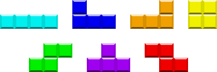
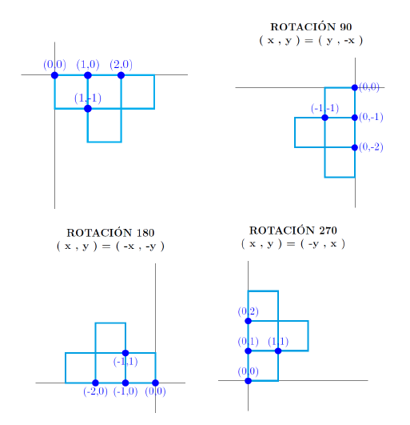

<p align="right"></p>

# TETRIS (Utilizando POO)
## Juan Sebastián Castro Pardo

___

### 1. Introducción

Tetris es un videojuego de lógica originalmente diseñado y programado por Alekséi Pázhitnov en la Unión Soviética. Su nombre deriva del prefijo griego *tetra* (todas las piezas del juego, conocidas como **tetrominós** que contienen cuatro segmentos) y del tenis. El juego está disponible para casi cada consola de videojuegos y sistemas operativos de PC, así como en dipositivos tales como las calculadoras gráficas, teléfonos móviles, reproductores de multimedia portátiles, PDAs, entre otros.

Distintos tetrominós, figuras geométricas compuestas por cuatro bloques cuadrados unidos de forma ortogonal, los cuales se generan de una zona que ocupa 5x5 bloques en el área superior de la pantalla. El jugador no puede impedir esta caída, pero puede decidir la rotación de la pieza (0°, 90°, 180°, 270°) y en qué lugar debe caer. Cuando una línea horizontal se completa, esa línea desaparece y todas las piezas que están por encima descienden una posición, liberando espacio del juego y por tanto dacilitando la tarea de situar piezas nuevas. La caída de las piezas se acelera progresivamente. El juego acaba cuando las piezas se amontonan hasta llegar a lo más alto (3x5 bloques en el área visible), interfiriendo la creación de más piezas y finalizando el juego.

<p align="center"></p>

### 2. Desarrollo

El programa se desarrolló en *processing*. Processing es un flexible software de bloc de dibujo y lenguaje para aprender como codificar en el contexto de las artes visuales. Para programar se empleo programación orientada a objetos.

La idea que desarrolle durante fue el uso de tres clases, llamadas *Tetromino*, *Tablero* y el *Tablero Memoria*, que las explicaré en detalle más adelante. La versión actual del programa es capaz de generar fichas aleatorias, posicionarlas en el fondo del tablero, apilarlas y eliminar las filas cuando estan estas se completen y llevar la cuenta del puntaje, nivel y filas eliminadas.

#### 2.1. Clases
##### 2.2. Tetromino

La clase tetromino es la encargada de la información y los métodos de cada tetromino que se crea y se pone en juego. Para instanciar la forma de cada tetromino, utilize arrays que contienen datos de las coordenadas de cada cuadro del tetromino. El sistema de coordenadas funciona de la siguiente manera:

<p align="center"></p>

La coordenada asignada a cada bloque no solo permite dibujarlo, sino también rotarlo facilmente. Para dibujar el bloque a partir de las coordenadas se hace de la siguiente manera:

```processing
//Arrays para cada ficha
int[][] O = {{0, 0}, {1, 0}, {0, 1}, {1, 1}}; //O
int[][] I = {{0, 0}, {1, 0}, {2, 0}, {3, 0}}; //I
int[][] T = {{0, 0}, {1, 0}, {2, 0}, {1, 1}}; //T
int[][] L = {{0, 0}, {1, 0}, {2, 0}, {0, 1}}; //L
int[][] J = {{0, 0}, {0, 1}, {1, 1}, {2, 1}}; //J
int[][] S = {{0, 1}, {1, 1}, {1, 0}, {2, 0}}; //S
int[][] Z = {{0, 0}, {1, 0}, {1, 1}, {2, 1}}; //Z

void display() {
    push();
    strokeWeight(1);
    fill(Color);
    for (int i = 0; i < 4; i++) { //Recorre el array de cada figura
      rect(figura[i][0] * t_casilla, figura[i][1] * t_casilla, t_casilla, t_casilla); \\t_casilla = width/24
    };
    pop();
  }
```

Para cada figura se crea un array bidimensional en donde las coordenadas *x* y *y* de cada punto se llaman utilizando ```figura[i][0]``` y ```figura[i][1]``` respectivamente, donde *i* es el elemento de la lista. Son varios los métodos que se encuentran dentro de la clase tetromino, el método ```display()``` que mostramos anteriormente, el ```m_sig()```, que se encarga de mostrar la siguiente figura en la parte derecha del tablero,

```processing
 void m_sig() { 
    fill(179, 244, 208);
    rect(width/2, 0, width/2, height);
    fill(0);
    text("SIGUIENTE FICHA:", width/2 + 60, 70);
    fill(83, 147, 111);
    text("SIGUIENTE FICHA:", width/2 + 62, 72);
    push();
    strokeWeight(1);
    fill(Color);
    for (int i = 0; i < 4; i++) {
      rect(figura[i][0] * t_casilla + width/2 + 140, figura[i][1] * t_casilla + 100, t_casilla, t_casilla); //La muestro en la parte derecha del tablero
    };
    pop();
  }
```
